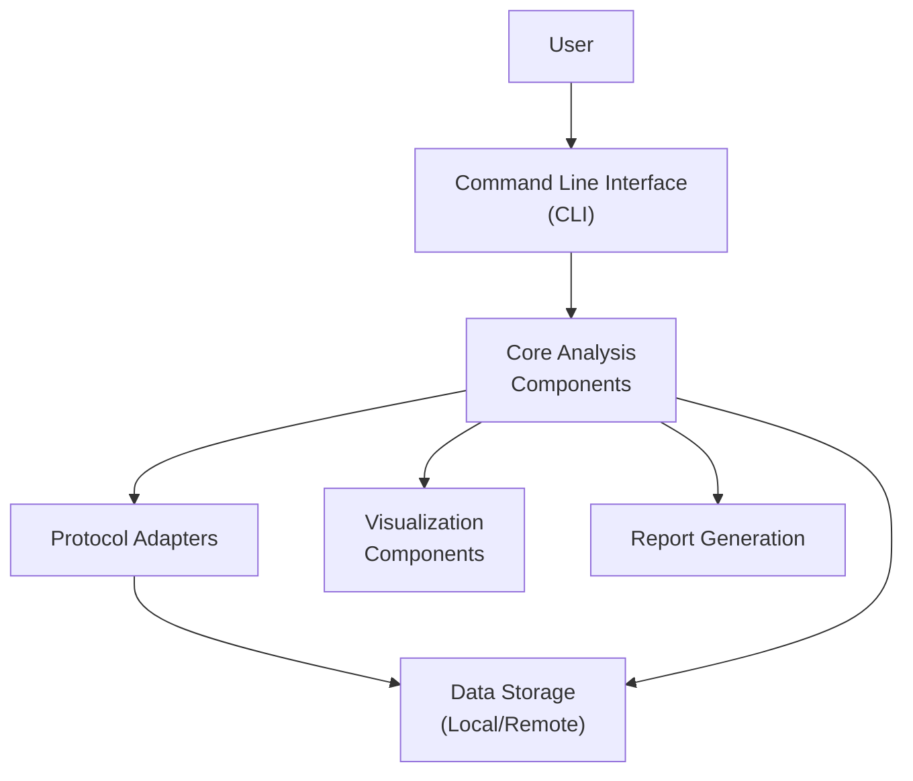
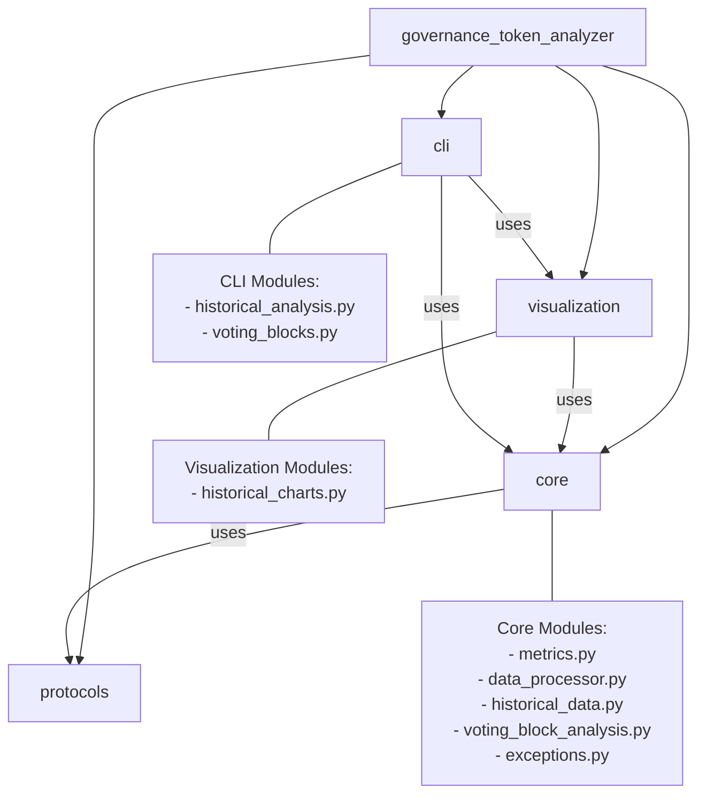
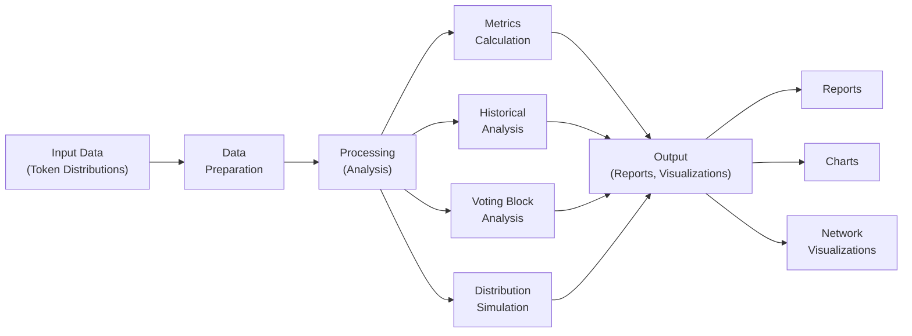
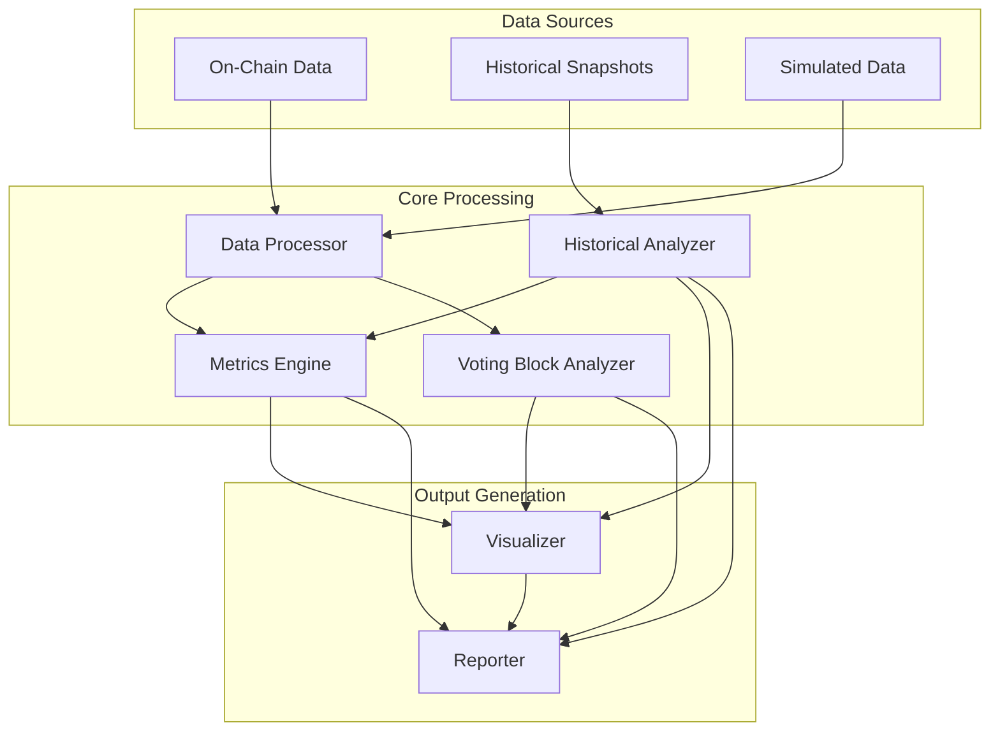
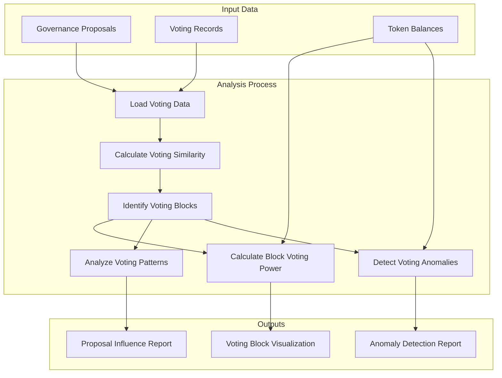

# Governance Token Distribution Analyzer

A tool for analyzing governance token distribution and governance participation across DeFi protocols.


[](https://dl.circleci.com/status-badge/redirect/circleci/FSXowV52GpBGpAqYmKsFET/DK2dtWwtKUMKPcYB93EPdr/tree/main)
[](https://github.com/your-username/governance-token-distribution-analyzer)
[](https://www.python.org/downloads/)
[](https://opensource.org/licenses/MIT)
[](https://codecov.io/gh/uelkerd/governance-token-distribution-analyzer)

--


[](https://codescene.io/projects/67798)[](https://codescene.io/projects/67798)[](https://codescene.io/projects/67798)

[](https://codescene.io/projects/67798)

## Overview

The Governance Token Distribution Analyzer provides tools to:

- Analyze token distributions for major DeFi governance tokens
- Calculate concentration metrics (Gini coefficient, Herfindahl index, etc.)
- Simulate different token distribution patterns
- Generate comprehensive reports and visualizations
- Compare distribution patterns across protocols
- Track historical changes in token distributions over time
- Analyze governance voting patterns and identify voting blocks
- **Fetch live blockchain data from multiple providers (Etherscan, The Graph, Alchemy, Infura) with robust fallback and error handling**
- **Gracefully handle missing API keys, rate limits, and provider outages by falling back to simulated or cached data**

This tool helps researchers, investors, and protocol designers understand the decentralization and concentration patterns in governance token distributions.

## Development Status

✅ **Integration Tests for Voting Block Analysis**: Comprehensive integration tests for the voting block analysis module are complete and passing, providing thorough test coverage for:
- End-to-end voting block analysis workflow
- Proposal influence analysis
- Voting anomaly detection
- Error handling
- Cross-integration with historical data

## Features

- **Protocol Analysis**: Support for Compound (COMP), Uniswap (UNI), and Aave (AAVE) tokens
- **Concentration Metrics**: Gini coefficient, Herfindahl index, Nakamoto coefficient, Palma ratio, and more
- **Simulation**: Generate realistic token distributions with different patterns
- **Visualization**: Create charts for distribution analysis and comparison
- **Historical Analysis**: Track and analyze changes in token distributions over time
- **Trend Detection**: Identify trends in governance token concentration
- **Reporting**: Generate comprehensive HTML reports with key insights
- **Command Line Interface**: User-friendly CLI for all functionality
- **Voting Block Analysis**: Identify coordinated governance participation and analyze voting patterns
- **Governance Anomaly Detection**: Detect unusual voting patterns that might indicate coordination
- **Live Data Integration**: Fetch real-time data from Etherscan, The Graph, Alchemy, and Infura with automatic fallback to simulated data if live data is unavailable
- **Robust Fallback Logic**: System automatically detects missing API keys, rate limits, or provider errors and logs warnings/errors while switching to fallback data sources

## Supported Protocols

- Compound (COMP)
- Uniswap (UNI)
- Aave (AAVE)

## Installation

1. Clone the repository:
```bash
git clone https://github.com/uelkerd/governance-token-distribution-analyzer.git
cd governance-token-distribution-analyzer
```

2. Create a virtual environment and install dependencies:
```bash
python -m venv venv
source venv/bin/activate  # On Windows: venv\Scripts\activate
pip install -r requirements.txt
```

## API Keys Setup

To fetch real data from blockchain APIs, you'll need to set up the following API keys:

1. **Etherscan API Key**:
   - Register at [https://etherscan.io/register](https://etherscan.io/register)
   - Create an API key in your account dashboard

2. **Ethplorer API Key**:
   - Register at [https://ethplorer.io/](https://ethplorer.io/)
   - Get your API key (free tier available)

3. **Infura API Key** (optional):
   - Register at [https://infura.io/](https://infura.io/)
   - Create a new project to get an API key

4. **The Graph API Key** (optional):
   - For higher rate limits with The Graph, get an API key at [https://thegraph.com/](https://thegraph.com/)

Set up these API keys as environment variables:

```bash
# Linux/macOS
export ETHERSCAN_API_KEY=your_etherscan_key
export ETHPLORER_API_KEY=your_ethplorer_key
export INFURA_API_KEY=your_infura_key
export GRAPH_API_KEY=your_graph_key

# Windows
set ETHERSCAN_API_KEY=your_etherscan_key
set ETHPLORER_API_KEY=your_ethplorer_key
set INFURA_API_KEY=your_infura_key
set GRAPH_API_KEY=your_graph_key
```

Alternatively, create a `.env` file in the project root:

```
ETHERSCAN_API_KEY=your_etherscan_key
ETHPLORER_API_KEY=your_ethplorer_key
INFURA_API_KEY=your_infura_key
GRAPH_API_KEY=your_graph_key
```

## Usage

### Basic Analysis

```python
from governance_token_analyzer.protocols import compound, uniswap, aave
from governance_token_analyzer.analysis import concentration

# Get Compound token holders (real data)
holders = compound.get_token_holders(use_real_data=True)

# Analyze token concentration
concentration_metrics = concentration.analyze_token_distribution(holders)
print(f"Top 10 holders control {concentration_metrics['top_10_percentage']:.2f}% of tokens")

# Get governance proposals
proposals = compound.get_governance_proposals(use_real_data=True)
```

### Sample vs. Real Data

The analyzer can work with both sample data and real API data:

```python
# Using sample data (default)
sample_holders = uniswap.get_token_holders()

# Using real API data
real_holders = uniswap.get_token_holders(use_real_data=True)
```

## Running Tests

Run the basic test suite:

```bash
pytest
```

Run tests including integration tests with real APIs:

```bash
SKIP_INTEGRATION_TESTS=false pytest
```

## Project Structure

- `governance_token_analyzer/`: Main package
  - `core/`: Core functionality
    - `api_client.py`: Client for fetching data from APIs
  - `protocols/`: Protocol-specific modules
    - `compound.py`: Compound-specific analysis
    - `uniswap.py`: Uniswap-specific analysis
    - `aave.py`: Aave-specific analysis
  - `analysis/`: Analysis modules
    - `concentration.py`: Token concentration analysis
    - `participation.py`: Governance participation analysis
- `tests/`: Test suite
  - `integration/`: Integration tests with real APIs

## License

MIT

## Documentation

Detailed documentation is available in the `docs/` directory:

- [Installation Guide](docs/installation.md)
- [Usage Guide](docs/usage.md)
- [CLI Usage](docs/cli_usage.md)
- [Historical Analysis](docs/historical_analysis.md)
- [Voting Block Analysis](docs/voting_block_analysis.md)
- [Integration Test Plan](tests/integration_test_plan.md)
- [Project Progress](PROGRESS.md)

## Development

### Project Structure

```
governance-token-analyzer/
├── docs/                   # Documentation
├── governance_token_analyzer/   # Main package
│   ├── core/               # Core analysis functionality
│   │   ├── historical_data.py    # Historical data analysis
│   │   ├── voting_block_analysis.py  # Voting block analysis
│   │   └── exceptions.py         # Custom exceptions
│   ├── protocols/          # Protocol-specific analysis
│   │   └── compound.py         # Compound-specific analysis
│   ├── visualization/      # Data visualization
│   │   └── historical_charts.py  # Historical data visualization
│   └── cli/                # Command-line interface
│       └── historical_analysis.py  # CLI for historical analysis
├── examples/               # Example scripts
│   └── voting_block_analysis_example.py  # Voting block analysis example
├── tests/                  # Tests
│   ├── integration/        # Integration tests
│   │   ├── test_historical_data_integration.py  # Historical data tests
│   │   ├── test_visualization_and_reporting.py  # Visualization tests
│   │   └── test_cli_integration.py  # CLI integration tests
│   └── test_*.py           # Unit tests
├── .github/                # GitHub workflows
│   └── workflows/          # CI/CD configuration
├── pyproject.toml          # Project metadata and dependencies
└── Makefile                # Development tasks
```

### Architecture Diagrams

#### Component Architecture



#### Module Relationships



#### Analysis Workflow



#### Data Flow Architecture



### Voting Block Analysis Flow



### Running Tests

```bash
# Run all tests
python -m pytest tests/

# Run with coverage
python -m pytest tests/ --cov=governance_token_analyzer

# Run only integration tests
python -m pytest tests/integration/ -v

# Run specific integration test
python -m pytest tests/integration/test_visualization_and_reporting.py -v

# Generate HTML coverage report
python -m pytest tests/ --cov=governance_token_analyzer --cov-report=html
```

### Integration Testing

The project includes comprehensive integration tests to ensure that components work together correctly:

- Historical data analysis integration
- Visualization and reporting integration
- CLI commands integration
- End-to-end workflow tests

Integration tests can be run using:

```bash
# Run all integration tests
make integration-test

# Run with coverage
make integration-test-cov

# Run full integration test suite with HTML report
make integration-full
```

### Continuous Integration

GitHub Actions workflows automatically run tests on pull requests and pushes to the main branch:

- Unit tests on Python 3.8, 3.9, and 3.10
- Integration tests with coverage reporting
- Linting and code style checks

### Formatting and Linting

```bash
# Format code
make format

# Check code style
make lint
```

## Contributing

Contributions are welcome! Please feel free to submit a Pull Request.

1. Fork the repository
2. Create your feature branch (`git checkout -b feature/amazing-feature`)
3. Commit your changes (`git commit -m 'Add some amazing feature'`)
4. Push to the branch (`git push origin feature/amazing-feature`)
5. Open a Pull Request

## License

This project is licensed under the MIT License - see the LICENSE file for details.

## Acknowledgments

- [DeFi Pulse](https://defipulse.com/) for DeFi protocol data
- [Etherscan](https://etherscan.io/) for blockchain data
- [Matplotlib](https://matplotlib.org/) and [Seaborn](https://seaborn.pydata.org/) for visualizations

## Fallback Behavior and Error Logging

The analyzer is designed to be robust in real-world conditions:

- If a required API key is missing or a provider is rate-limited/unavailable, the system will log a warning and automatically fall back to simulated or cached data.
- All errors and warnings are logged with context to help with debugging and transparency.
- The system validates data structure and quality at every step, ensuring that analysis is only performed on well-formed data.

## Live Data Validation Script

A standalone script is provided to validate that live API integrations are working correctly:

```bash
python scripts/validate_live_data.py
```

This script will:
- Check for available API keys (Etherscan, The Graph, Alchemy, Infura)
- Attempt to fetch live token holder data for Compound, Uniswap, and Aave
- Validate the structure and quality of returned data
- Log all errors and warnings, and print a summary of validation results
- Exit with a nonzero code if any critical errors are detected

Use this script to verify your environment and API setup before running full analyses or deploying.
