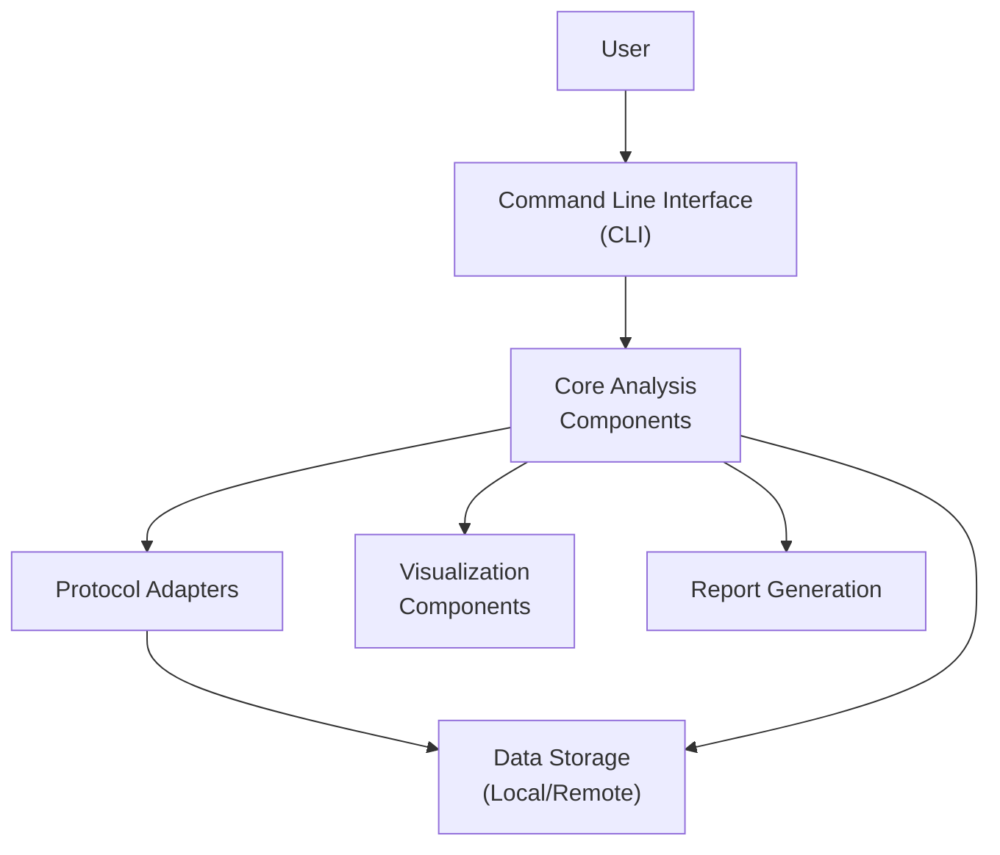
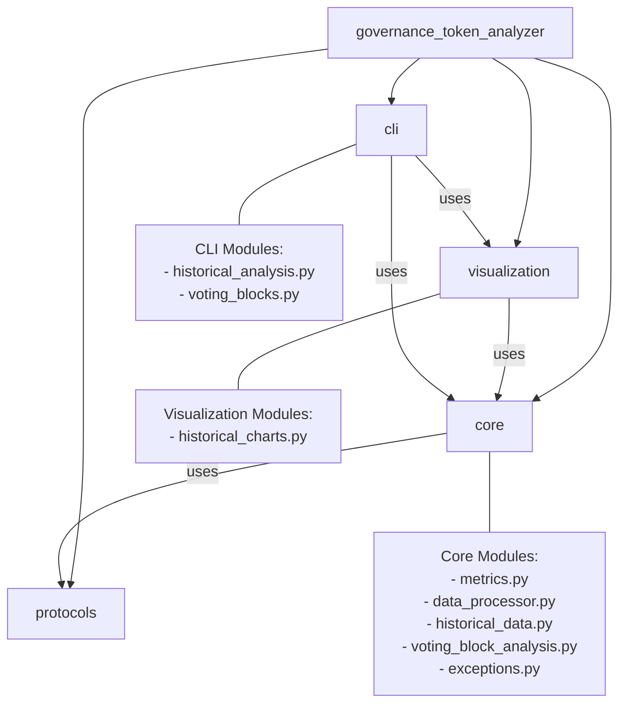
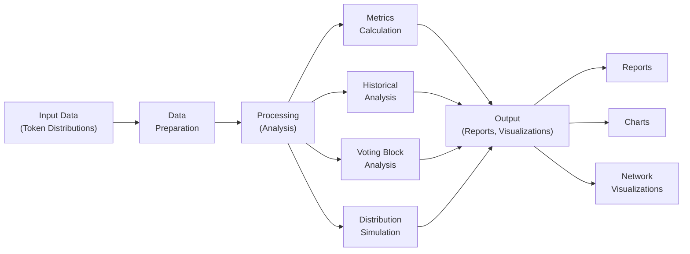
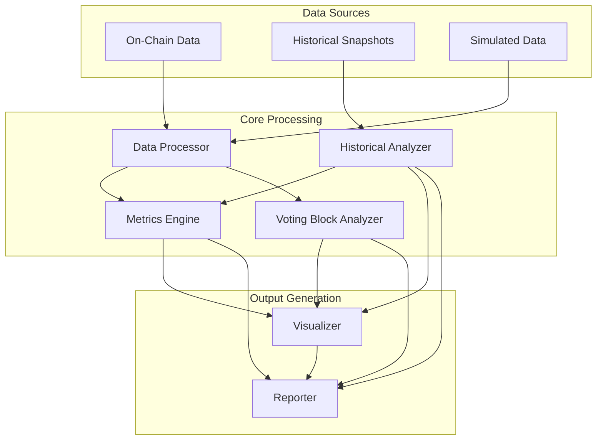
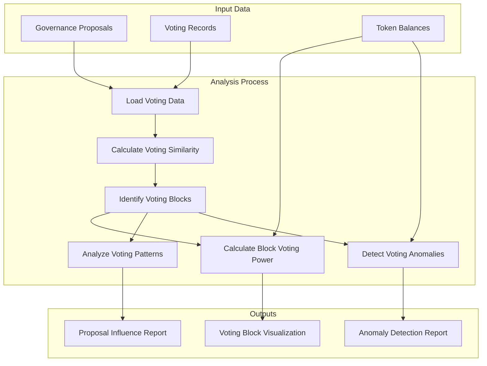

# Governance Token Distribution Analyzer

A tool for analyzing governance token distributions across DeFi protocols like Compound, Uniswap, and Aave.

[](https://github.com/your-username/governance-token-distribution-analyzer)
[](https://www.python.org/downloads/)
[](https://opensource.org/licenses/MIT)
[](https://codecov.io/gh/uelkerd/governance-token-distribution-analyzer)

## Overview

The Governance Token Distribution Analyzer provides tools to:

- Analyze token distributions for major DeFi governance tokens
- Calculate concentration metrics (Gini coefficient, Herfindahl index, etc.)
- Simulate different token distribution patterns
- Generate comprehensive reports and visualizations
- Compare distribution patterns across protocols
- Track historical changes in token distributions over time
- Analyze governance voting patterns and identify voting blocks

This tool helps researchers, investors, and protocol designers understand the decentralization and concentration patterns in governance token distributions.

## Development Status

✅ **Integration Tests for Voting Block Analysis**: Comprehensive integration tests for the voting block analysis module are complete and passing, providing thorough test coverage for:
- End-to-end voting block analysis workflow
- Proposal influence analysis
- Voting anomaly detection
- Error handling
- Cross-integration with historical data

## Features

- **Protocol Analysis**: Support for Compound (COMP), Uniswap (UNI), and Aave (AAVE) tokens
- **Concentration Metrics**: Gini coefficient, Herfindahl index, Nakamoto coefficient, Palma ratio, and more
- **Simulation**: Generate realistic token distributions with different patterns
- **Visualization**: Create charts for distribution analysis and comparison
- **Historical Analysis**: Track and analyze changes in token distributions over time
- **Trend Detection**: Identify trends in governance token concentration
- **Reporting**: Generate comprehensive HTML reports with key insights
- **Command Line Interface**: User-friendly CLI for all functionality
- **Voting Block Analysis**: Identify coordinated governance participation and analyze voting patterns
- **Governance Anomaly Detection**: Detect unusual voting patterns that might indicate coordination

## Installation

### Prerequisites

- Python 3.8 or higher
- pip (Python package installer)

### From Source

1. Clone the repository:
   ```bash
   git clone https://github.com/uelkerd/governance-token-distribution-analyzer.git
   cd governance-token-distribution-analyzer
   ```

2. Create and activate a virtual environment (recommended):
   ```bash
   # On macOS/Linux
   python -m venv .venv
   source .venv/bin/activate
   
   # On Windows
   python -m venv .venv
   .venv\Scripts\activate
   ```

3. Install the package in development mode:
   ```bash
   pip install -e .
   ```

### Using Make

The project includes a Makefile for common tasks:

```bash
# Install the package
make install

# Install with development dependencies
make install-dev

# Run tests
make test

# Run integration tests
make integration-test

# Run integration tests with coverage
make integration-test-cov
```

## Quick Start

After installation, you can use the command-line interface:

```bash
# Analyze Compound token distribution
token-analyzer analyze compound

# Compare multiple token distributions
token-analyzer compare compound uniswap

# Generate a simulated distribution
token-analyzer simulate power_law

# Create a comprehensive report
token-analyzer report compound uniswap aave

# Analyze historical data
token-analyzer historical-analysis --protocol compound --metric gini_coefficient

# Compare protocols over time
token-analyzer compare-protocols --protocols compound,uniswap,aave --historical

# Analyze voting blocks
token-analyzer voting-blocks --protocol compound --proposals recent

# Detect voting anomalies
token-analyzer detect-anomalies --protocol uniswap --timeframe 3m
```

## Historical Data Analysis

The tool provides functionality to track and analyze changes in token distributions over time:

```bash
# Simulate historical data
token-analyzer historical simulate --protocol compound --num-snapshots 12 --interval-days 30

# Generate a historical data report
token-analyzer historical generate-report --protocol compound

# Export historical data as JSON
token-analyzer export-historical-data --protocol compound --metric gini_coefficient --format json

# Compare multiple protocols over time
token-analyzer historical compare-protocols --protocols compound,uniswap,aave --metric gini_coefficient
```

## Voting Block Analysis

The tool provides functionality to analyze governance voting patterns and identify coordination:

```bash
# Identify voting blocks in a protocol
token-analyzer voting-blocks --protocol compound

# Calculate voting power of identified blocks
token-analyzer voting-power --protocol compound --blocks-file blocks.json

# Analyze influence of large token holders on proposals
token-analyzer proposal-influence --protocol aave --proposals recent

# Detect anomalies in voting patterns
token-analyzer voting-anomalies --protocol uniswap --timeframe 6m

# Generate a comprehensive voting analysis report
token-analyzer voting-report --protocol compound --include-visualizations
```

## Documentation

Detailed documentation is available in the `docs/` directory:

- [Installation Guide](docs/installation.md)
- [Usage Guide](docs/usage.md)
- [CLI Usage](docs/cli_usage.md)
- [Historical Analysis](docs/historical_analysis.md)
- [Voting Block Analysis](docs/voting_block_analysis.md)
- [Integration Test Plan](tests/integration_test_plan.md)
- [Project Progress](PROGRESS.md)

## Development

### Project Structure

```
governance-token-analyzer/
├── docs/                   # Documentation
├── governance_token_analyzer/   # Main package
│   ├── core/               # Core analysis functionality
│   │   ├── historical_data.py    # Historical data analysis
│   │   ├── voting_block_analysis.py  # Voting block analysis
│   │   └── exceptions.py         # Custom exceptions
│   ├── protocols/          # Protocol-specific analysis
│   ├── visualization/      # Data visualization
│   │   └── historical_charts.py  # Historical data visualization
│   └── cli/                # Command-line interface
│       └── historical_analysis.py  # CLI for historical analysis
├── examples/               # Example scripts
│   └── voting_block_analysis_example.py  # Voting block analysis example
├── tests/                  # Tests
│   ├── integration/        # Integration tests
│   │   ├── test_historical_data_integration.py  # Historical data tests
│   │   ├── test_visualization_and_reporting.py  # Visualization tests
│   │   └── test_cli_integration.py  # CLI integration tests
│   └── test_*.py           # Unit tests
├── .github/                # GitHub workflows
│   └── workflows/          # CI/CD configuration
├── pyproject.toml          # Project metadata and dependencies
└── Makefile                # Development tasks
```

### Architecture Diagrams

#### Component Architecture



#### Module Relationships



#### Analysis Workflow



#### Data Flow Architecture



### Voting Block Analysis Flow



### Running Tests

```bash
# Run all tests
python -m pytest tests/

# Run with coverage
python -m pytest tests/ --cov=governance_token_analyzer

# Run only integration tests
python -m pytest tests/integration/ -v

# Run specific integration test
python -m pytest tests/integration/test_visualization_and_reporting.py -v

# Generate HTML coverage report
python -m pytest tests/ --cov=governance_token_analyzer --cov-report=html
```

### Integration Testing

The project includes comprehensive integration tests to ensure that components work together correctly:

- Historical data analysis integration
- Visualization and reporting integration
- CLI commands integration
- End-to-end workflow tests

Integration tests can be run using:

```bash
# Run all integration tests
make integration-test

# Run with coverage
make integration-test-cov

# Run full integration test suite with HTML report
make integration-full
```

### Continuous Integration

GitHub Actions workflows automatically run tests on pull requests and pushes to the main branch:

- Unit tests on Python 3.8, 3.9, and 3.10
- Integration tests with coverage reporting
- Linting and code style checks

### Formatting and Linting

```bash
# Format code
make format

# Check code style
make lint
```

## Contributing

Contributions are welcome! Please feel free to submit a Pull Request.

1. Fork the repository
2. Create your feature branch (`git checkout -b feature/amazing-feature`)
3. Commit your changes (`git commit -m 'Add some amazing feature'`)
4. Push to the branch (`git push origin feature/amazing-feature`)
5. Open a Pull Request

## License

This project is licensed under the MIT License - see the LICENSE file for details.

## Acknowledgments

- [DeFi Pulse](https://defipulse.com/) for DeFi protocol data
- [Etherscan](https://etherscan.io/) for blockchain data
- [Matplotlib](https://matplotlib.org/) and [Seaborn](https://seaborn.pydata.org/) for visualizations